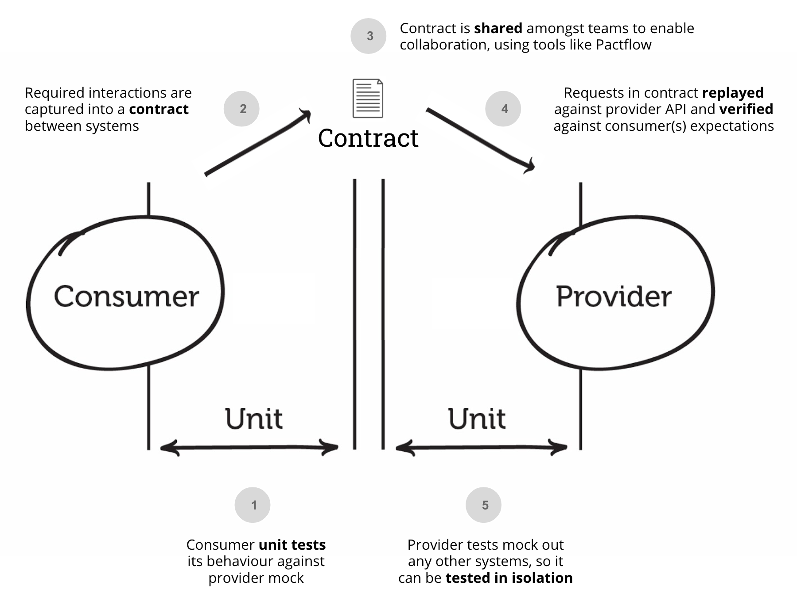

# Consumer Tests

## Contract Testing Process (HTTP)

Pact is a consumer-driven contract testing tool, which is a fancy way of saying that the API `Consumer` writes a test to set out its assumptions and needs of its API `Provider`(s). By unit testing our API client with Pact, it will produce a `contract` that we can share to our `Provider` to confirm these assumptions and prevent breaking changes.

The process looks like this:



1. The consumer writes a unit test of its behaviour using a Mock provided by Pact
1. Pact writes the interactions into a contract file (as a JSON document)
1. The consumer publishes the contract to a broker (or shares the file in some other way)
1. Pact retrieves the contracts and replays the requests against a locally running provider
1. The provider should stub out its dependencies during a Pact test, to ensure tests are fast and more deterministic.

In this document, we will cover steps 1-3.

## Consumer package

To use the library on your tests, add the pact dependency:

```javascript
const { Pact } = require("@pact-foundation/pact")
```

`PactV4` aliased as `Pact` is the latest version of this library, supporting up to and including version 4 of the [Pact Specification](https://github.com/pact-foundation/pact-specification/). It also allows interactions of multiple types (HTTP, async, synchronous). For previous versions, see below.

<details><summary>Previous versions</summary>


```javascript
const { PactV2 } = require("@pact-foundation/pact")   // Supports up to and including Pact Specification version 2
const { PactV3 } = require("@pact-foundation/pact") // Supportsu up to and including Pact Specification version 3
```

You should use the `Pact` interface unless you can't, and set the specification version via `spec` to the desired serialisation format.

</details>

The `Pact` class provides the following high-level APIs, they are listed in the order in which they typically get called in the lifecycle of testing a consumer:

### API

<details><summary>Consumer API</summary>

The Pact SDK uses a fluent builder to create interactions. 

| API                              | Options                            | Description                                                                                                                                                            |
| -------------------------------- | ---------------------------------- | ---------------------------------------------------------------------------------------------------------------------------------------------------------------------- |
| `new Pact(options)`            | See constructor options below      | Creates a Mock Server test double of your Provider API. The class is **not** thread safe, but you can run tests in parallel by creating as many instances as you need. |
| `addInteraction(...)`            | `V4UnconfiguredInteraction`        | Start a builder for an HTTP interaction                                                                                                                                |
| `addSynchronousInteraction(...)` | `V4UnconfiguredSynchronousMessage` | Start a builder for an asynchronous message                                                                                                                            |

#### Common methods to builders


| `given(...)`                           | Object             | Set one or more provider states for the interaction                                                                                                                                                                                                                                                                                                                                 |
| `uponReceiving(...)`                   | string                        | The scenario name. The combination of `given` and `uponReceiving` must be unique in the pact file                                                                                                                                                                                                                                                                      |
| `executeTest(...)`                     | -                             | Executes a user defined function, passing in details of the dynamic mock service for use in the test. If successful, the pact file is updated. The function signature changes depending on the setup and context of the interaction.                                                                                                                                                                                                                          |

</details>

<details><summary>Constructor</summary>

| Parameter  | Required? | Type    | Description                                                                               |
| ---------- | --------- | ------- | ----------------------------------------------------------------------------------------- |
| `consumer` | yes       | string  | The name of the consumer                                                                  |
| `provider` | yes       | string  | The name of the provider                                                                  |
| `port`     | no        | number  | The port to run the mock service on, defaults to a random machine assigned available port |
| `host`     | no        | string  | The host to run the mock service, defaults to 127.0.0.1                                   |
| `tls`      | no        | boolean | flag to identify which protocol to be used (default false, HTTP)                          |
| `dir`      | no        | string  | Directory to output pact files                                                            |
| `log`      | no        | string  | File to log to                                                                            |
| `logLevel` | no        | string  | Log level: one of 'trace', 'debug', 'info', 'error', 'fatal' or 'warn'                    |
| `spec`     | no        | number  | Pact specification version (defaults to 2)                                                |

</details>

### Example

The first step is to create a test for your API Consumer. The example below uses [Mocha](https://mochajs.org), and demonstrates the basic approach:

1.  Create the Pact object
1.  Start the Mock Provider that will stand in for your actual Provider
1.  Add the interactions you expect your consumer code to make when executing the tests
1.  Write your tests - the important thing here is that you test the outbound _collaborating_ function which calls the Provider, and not just issue raw http requests to the Provider. This ensures you are testing your actual running code, just like you would in any other unit test, and that the tests will always remain up to date with what your consumer is doing.
1.  Validate the expected interactions were made between your consumer and the Mock Service
1.  Generate the pact(s)

_NOTE: you must also ensure you clear out your pact directory prior to running tests to ensure outdated interactions do not hang around_

Check out the [examples](https://github.com/pact-foundation/pact-js/tree/master/examples/) for more of these.

```js
/* tslint:disable:no-unused-expression object-literal-sort-keys max-classes-per-file no-empty */
import * as chai from 'chai';
import chaiAsPromised from 'chai-as-promised';
import * as path from 'path';
import sinonChai from 'sinon-chai';
import { Pact, Matchers, SpecificationVersion } from '@pact-foundation/pact';

const expect = chai.expect;
import { DogService } from '../src/index';
const { eachLike } = Matchers;

chai.use(sinonChai);
chai.use(chaiAsPromised);
const LOG_LEVEL = process.env.LOG_LEVEL || 'TRACE';

describe('GET /dogs', () => {
  let dogService: DogService;

  // Create a 'pact' between the two applications in the integration we are testing
  const provider = new Pact({
    dir: path.resolve(process.cwd(), 'pacts'),
    consumer: 'MyConsumer',
    provider: 'MyProvider',
    spec: SpecificationVersion.SPECIFICATION_VERSION_V4, // Modify this as needed for your use case
  });
  it('returns an HTTP 200 and a list of dogs', async () => {
    const dogExample = { dog: 1 };
    const EXPECTED_BODY = eachLike(dogExample);

    // Arrange: Setup our expected interactions
    //
    // We use Pact to mock out the backend API
    await provider
      .addInteraction()
      .given('I have a list of dogs')
      .uponReceiving('a request for all dogs with the builder pattern')
      .withRequest('GET', '/dogs', (builder) => {
        builder.query({ from: 'today' });
        builder.headers({ Accept: 'application/json' });
      })
      .willRespondWith(200, (builder) => {
        builder.headers({ 'Content-Type': 'application/json' });
        builder.jsonBody(EXPECTED_BODY);
      })
      .executeTest(async (mockserver) => {
        // Act: test our API client behaves correctly
        //
        // Note we configure the DogService API client dynamically to
        // point to the mock service Pact created for us, instead of
        // the real one
        dogService = new DogService({ url: mockserver.url });
        const response = await dogService.getMeDogs('today');

        // Assert: check the result
        expect(response.data[0]).to.deep.eq(dogExample);
        return response;
      });
  });
});
```

Read on about [matching](/docs/matching.md)

## Publishing Pacts to a Broker

Sharing is caring - to simplify sharing Pacts between Consumers and Providers, we have created the [Pact Broker](https://docs.pact.io/pact_broker).

The Broker:

- versions your contracts
- tells you which versions of your applications can be deployed safely together
- allows you to deploy your services independently
- provides API documentation of your applications that is guaranteed to be up-to date
- visualises the relationships between your services
- integrates with other systems, such as Slack or your CI server, via webhooks
- ...and much much [more](https://docs.pact.io/getting_started/sharing_pacts).

[Host your own using the open source docker image](https://docs.pact.io/pact_broker/docker_images), or sign-up for a [free hosted Pact Broker](https://pactflow.io) with our friends at PactFlow.

### Publish in npm scripts

The easiest way to publish pacts to the broker is via an npm script in your package.json:

```

   "test:publish": "./node_modules/.bin/pact-broker publish <YOUR_PACT_FILES_OR_DIR> --consumer-app-version=\"$(npx absolute-version)\" --auto-detect-version-properties --broker-base-url=https://your-broker-url.example.com"
```

You'll need to install [`@pact-foundation/pact-cli`](https://github.com/pact-foundation/pact-js-cli) package to use the `pact-broker` command. This is a standalone package that can be installed via npm.

For a full list of the options, see the [CLI usage instructions](https://github.com/pact-foundation/pact-ruby-standalone/releases).

All CLI binaries are available in npm scripts when using pact-js-cli `@pact-foundation/pact-cli`.

If you want to pass your username and password to the broker without including
them in scripts, you can provide it via the environment variables
`PACT_BROKER_USERNAME` and `PACT_BROKER_PASSWORD`. If your broker supports an
access token instead of a password, use the environment variable
`PACT_BROKER_TOKEN`.