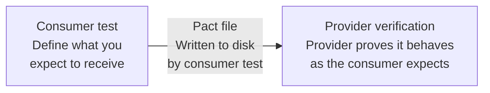

# pact-js Examples

This directory contains educational examples for [pact-js](https://github.com/pact-foundation/pact-js), demonstrating consumer-driven contract testing with [Pact](https://docs.pact.io).

**New to Pact? Start with [`http/`](./http/).**

## The Pact Workflow



1. The **consumer** writes a test that defines the interactions it needs. Pact generates a **pact file** (JSON) describing those interactions. In these examples, pact files are written to disk for simplicity.
2. The **provider** runs the pact file against its real implementation, verifying each interaction in isolation.
3. If the provider passes, both sides can deploy independently — neither will break the other.

For team workflows, pact files are published to a Pact Broker (such as [PactFlow.io](https://pactflow.io) or the open source [Pact Broker](https://docs.pact.io/pact_broker)) to enable proper deployment checks like `can-i-deploy`.

## Examples

| Example                                | What it demonstrates                                             |
| -------------------------------------- | ---------------------------------------------------------------- |
| [`http/`](./http/)                     | **Start here.** Canonical HTTP consumer/provider                 |
| [`matchers/`](./matchers/)             | Pact matcher library (`like`, `regex`, `eachLike`, etc.)         |
| [`graphql/`](./graphql/)               | GraphQL over HTTP using `addGraphQLInteraction()`                |
| [`messages/`](./messages/)             | Async/event-driven messaging with `addAsynchronousInteraction()` |
| [`multipart/`](./multipart/)           | File upload and multipart form data                              |
| [`plugins/`](./plugins/)               | Plugin system for custom protocols (gRPC, MATT, etc.)            |
| [`provider-state/`](./provider-state/) | Provider states, parameterised states, and `fromProviderState()` |
| [`xml/`](./xml/)                       | XML response matching with `XmlBuilder`                          |

## Running an Example

Each example is a standalone npm project:

```bash
cd examples/http
npm install
npm test          # runs consumer then provider
npm run test:consumer   # generate pact file only
npm run test:provider   # verify pact file only
```

## Historical Reference

The previous `v2/`, `v3/`, and `v4/` examples are available in [git history](https://github.com/pact-foundation/pact-js/tree/3e1755a60934b366c2da95b998777c15f0236661/examples) for reference. The regression test suite covering the v2/v3 API surfaces lives in `regression/` at the repository root.
